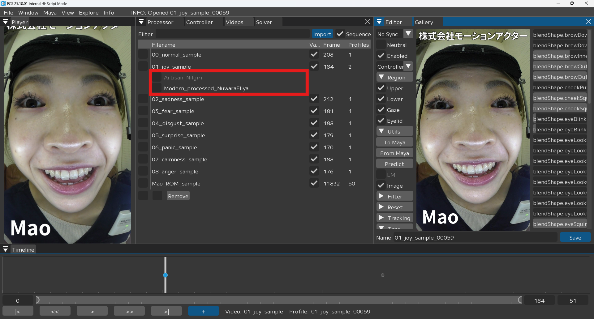

# FCS内部の処理
この項目では、アクターの画像から表情をトラッキングし、キャラクターの表情に変換するまでの流れについて説明します。

  
*Overview*
<!---
この項目では、登録されたプロファイルに基づいて動画からアニメーションが出力されるまでの流れについて説明します。
この処理は、登録されたプロファイルに基づきアクターの表情とキャラクターの表情の関係性を学習する段階と、動画に対するキャラクターアニメーションを予測する段階の2段階により構成されています。
プロファイル画像や動画フレームの1枚ずつに対してアクターの表情を取得し、キャラクターの表情に変換します。
--->

<!---
全体像を図示
目を見開いたプロファイルと目を閉じているプロファイルから細目の画像を予測する的なやつ
## アクターの表情を取得
--->

## 1. フェイシャルトラッキング

まず、画像からアクターの表情を取得するためにフェイシャルトラッキングを実行します。FCSのオートトラッキング機能では、画像に対してアクターの顔の3次元モデル（アクターモデル）を構築します。これにより、目や口の輪郭や鼻の位置を表す点（ランドマーク）の座標や、表情パラメータ（ARKitブレンドシェイプ）といった情報を取得します。  
トラッキングに使用するモデルはパイプラインによって異なり、パイプライン名に"+"がついているものはツークン研究所独自のモデルになります。

動画を処理すると、Videosウィンドウの動画名の下にトラッキング結果（トラッキングシーケンス）が表示されます。異なるトラッキングモデルにより作成されたトラッキングシーケンスは互換性がないのでご注意ください。

  
*トラッキングシーケンス*
<!---
UIの画像とトラキングシーけンスの追加の説明
アクターの画像とトラッキングされたFLAMEのレンダリング画像

--->

## 2. 顔の向きを補正

パイプライン名に"RP"が入っているパイプラインを選択した場合、顔の向きがNeutralのプロファイルと同じ向きになるように補正します。これにより、カメラの揺れやずれによる影響を軽減します。

<!---
補正前後のFLAMEのレンダリング画像

--->

## 3. トラッキング情報の取捨選択

コントローラーごとに関連するブレンドシェイプを選択することで、コントローラー値に変換する際に使用するランドマークとブレンドシェイプを限定することができます。

### ブレンドシェイプの選択方法

ControllerウィンドウにあるControllerテーブルのヘッダーを右クリックするとコンテキストメニューが表示されるので、

  
*"blendshape"を有効化し*

  
*設定したいコントローラーを選択しブレンドシェイプを設定*
*※最後にコントローラーの設定を保存する必要があります。*

<!---
図
eyelidで左右をわけるやつとか

UI

--->

## 4. キャラクターの表情に変換

<!---
ここまでの工程で得られるアクターの表情のトラッキング情報をコントローラー値に変換し、キャラクターアニメーションを出力します。
--->

ここまでの工程で得られるアクターの表情に対して、類似するプロファイルを選出しその比率を計算します。それぞれのプロファイルに対応したキャラクターの表情を、計算された比率に応じてブレンドすることで、アクターの表情をキャラクターの表情へと変換します。

  
*Solve*